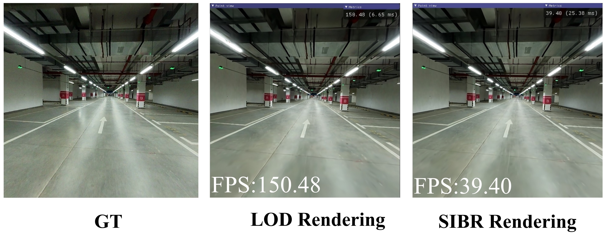

# LetsGo: Large-Scale Garage Modeling and Rendering via LiDAR-Assisted Gaussian Primitives
Jiadi Cui*, Junming Cao*, Fuqiang Zhao*, Zhipeng He, Yifan Chen, Yuhui Zhong, Lan Xu, Yujiao Shi, Yingliang Zhang†, Jingyi Yu†

[Project page](https://zhaofuq.github.io/LetsGo/) | [Paper](https://arxiv.org/pdf/2404.09748) | [Video](https://www.youtube.com/watch?v=fs42UBKvGRw) | [LOD Viewer (SIBR)](https://zhaofuq.github.io/LetsGo/) | [Web Viewer](https://zhaofuq.github.io/LetsGo/)| [GarageWorld Dataset](https://zhaofuq.github.io/LetsGo/) <br>


This repository contains the official implementation associated with the paper "LetsGo: Large-Scale Garage Modeling and Rendering via LiDAR-Assisted Gaussian Primitives"

## Abstract

Large garages are ubiquitous yet intricate scenes in our daily lives. They pose challenges characterized by monotonous colors, repetitive patterns, reflective surfaces, and transparent vehicle glass. 
Conventional Structure from Motion (SfM) methods for camera pose estimation and 3D reconstruction fail in these environments due to poor correspondence construction. To address these challenges, this paper introduces LetsGo, a LiDAR-assisted Gaussian splatting framework for large-scale garage modeling and rendering.
We develop a handheld scanner, Polar, equipped with IMU, LiDAR, and a fisheye camera, to facilitate accurate LiDAR and image data scanning. 
With this Polar device, we present a GarageWorld dataset consisting of eight expansive garage scenes with diverse geometric structures and will release the dataset to the community for further research.
We demonstrate that the collected LiDAR point cloud by the Polar device enhances a suite of 3D Gaussian splatting algorithms for garage scene modeling and rendering. 
We also introduce a novel depth regularizer that effectively eliminates floating artifacts in rendered images.
Furthermore, we propose a multi-resolution 3D Gaussian representation designed for Level-of-Detail rendering. We use tailored scaling factors for individual levels and a random-resolution-level training scheme to optimize the Gaussians across different levels. This 3D Gaussian representation enables efficient rendering of large-scale garage scenes on lightweight devices via a web-based renderer. 
Experimental results on our dataset, along with ScanNet++ and KITTI-360, demonstrate the superiority of our method in rendering quality and resource efficiency.

## Installation
```bash
# clone repo
git clone https://github.com/zhaofuq/LOD-3DGS.git --recursive

# create a new python environment
conda env create --file environment.yml
conda activate lod-3dgs

# build PotreeConverter for Multi-Resolution Pointcloud
cd PotreeConverter 
cmake . -B build
cmake --build build --config Release
```

## Training
To train a scene in our GarageWorld dataset, simply use
```bash
python train.py -s <path to GarageWorld scene with COLMAP format> \
    --use_lod \
    --sh_degree 2 \
    --densification_interval 10000 \
    --iterations 300000 \
    -opacity_reset_interval 300000 \ 
    --densify_until_iter 200000 \
    --data_device cpu \
    -r 1
```

## Rendering
To render a trained model, simply use
```bash
python render.py -m <path to model path> 
```

## Interactive LOD Viewers
Our viewing solutions are based on the SIBR framework, developed by the GRAPHDECO group for several novel-view synthesis projects. We intergrate LOD rendering technique into SIBR framework to make faster rendering effects.



### Hardware Requirements

- CUDA-ready GPU with Compute Capability 7.0+
- 24 GB VRAM (to train to paper evaluation quality)
- Please see FAQ for smaller VRAM configurations

### Software Requirements
- Conda (recommended for easy setup)
- C++ Compiler for PyTorch extensions (we used Visual Studio 2019 for Windows)
- CUDA SDK 11 for PyTorch extensions, install *after* Visual Studio (we used 11.8, **known issues with 11.6**)
- C++ Compiler and CUDA SDK must be compatible

### Installation from Source
If you cloned with submodules (e.g., using ```--recursive```), the source code for the viewers is found in ```SIBR_viewers```. The network viewer runs within the SIBR framework for Image-based Rendering applications.

#### Windows
CMake should take care of your dependencies.
```shell
cd SIBR_viewers
cmake . -B build
cmake --build build --target install --config RelWithDebInfo
```
You may specify a different configuration, e.g. ```Debug``` if you need more control during development.

#### Ubuntu 22.04
You will need to install a few dependencies before running the project setup.
```shell
# Dependencies
sudo apt install -y libglew-dev libassimp-dev libboost-all-dev libgtk-3-dev libopencv-dev libglfw3-dev libavdevice-dev libavcodec-dev libeigen3-dev libxxf86vm-dev libembree-dev
# Project setup
cd SIBR_viewers
cmake -Bbuild . -DCMAKE_BUILD_TYPE=Release # add -G Ninja to build faster
cmake --build build -j24 --target install
``` 

#### Ubuntu 20.04
Backwards compatibility with Focal Fossa is not fully tested, but building SIBR with CMake should still work after invoking
```shell
git checkout fossa_compatibility
```

## GarageWorld Dataset
### Self-designed Polar Scanning System
Using our polar divide, we build GarageWorld, the first large-scale garage dataset.


### GarageWorld Dataset


<section class="section" id="BibTeX">
  <div class="container is-max-desktop content">
    <h2 class="title">BibTeX</h2>
    <pre><code>@article{cui2024letsgo,
        title={LetsGo: Large-Scale Garage Modeling and Rendering via LiDAR-Assisted Gaussian Primitives},
        author={Jiadi Cui, Junming Cao, Fuqiang Zhao, Zhipeng He, Yifan Chen, Yuhui Zhong, Lan Xu, Yujiao Shi, Yingliang Zhang, Jingyi Yu},
        journal={arXiv preprint arXiv:2404.09748},
        year={2024}
    }
</code></pre>
  </div>
</section>
